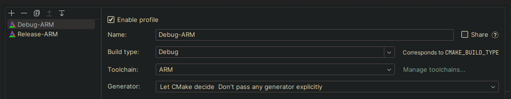

># STM32U385
>*HAL library and bootloader for STM32U385*
>## Setup
>1. open the project in clion
>2. Open the toolchain editor by pressing the 'Manage toolchains...'
>   
>3. configure the ARM toolchain
>   
>4. configure the run configuration
>   
>   CMake options: `-D CMAKE_TOOLCHAIN_FILE=cmake/arm-none-eabi.cmake`

